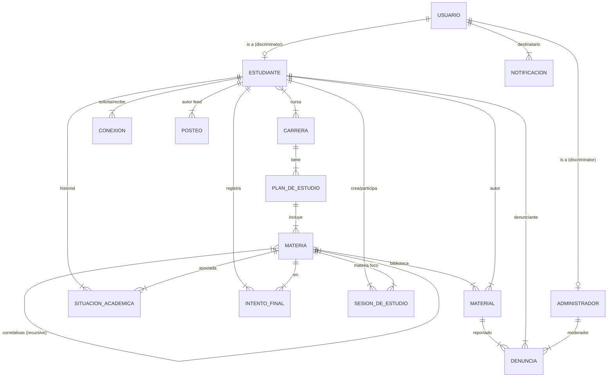

# DER - Diagrama Entidad-Relación

**Sprint:** 1. **Responsable:** Santino Galdín (@SantinoGaldin1). **Estado:** Finalizado.

## Diagrama (Mermaid)

## Decisiones de Modelado

1.  **Herencia de Usuarios:** Se utiliza el patrón **Discriminator** de Mongoose para `Estudiante` y `Administrador`. Ambos comparten la colección `users` para facilitar la autenticación, pero tienen esquemas diferenciados para sus perfiles.
2.  **Correlatividades:** Se modelan como arreglos de IDs (`correlativasParaCursar` y `correlativasParaRendir`) dentro de la propia entidad `Materia`. Esto simplifica la consulta de requisitos de una materia específica sin necesidad de joins complejos.
3.  **Feed de Actividad:** Se utiliza una entidad `Posteo` denormalizada. Las acciones relevantes (como subir un material o crear una sesión) generan opcionalmente un `Posteo` en el feed para optimizar la lectura del muro social.
4.  **Situación Académica:** Se mantiene un registro acumulativo por `Estudiante-Materia` en `SituacionAcademica`, pero se complementa con `IntentoFinal` para auditar la historia de exámenes (fechas y notas).
5.  **Archivos:** El sistema no almacena binarios directamente. La entidad `Material` guarda la `URL` (apuntando a un bucket S3 o similar) y metadatos.
6.  **Eliminación:** Se implementa **Soft-Delete** para `Material`, `Posteo` y `SesionDeEstudio` mediante un flag `isDeleted` o `estado: suspendido`. Esto permite mantener la integridad de las denuncias y el historial.

## Entidades Detalladas

### Usuario (Colección Base)
- `_id`: ObjectId
- `email`: String (Unique, Indexed)
- `passwordHash`: String
- `role`: Enum ("estudiante", "admin")
- `nombre`: String
- `apellido`: String
- `foto`: String (URL)
- `estado`: Enum ("activo", "suspendido")
- `createdAt`, `updatedAt`: Date

### Estudiante (Usuario Discriminator)
- `dni`: String (Unique)
- `legajo`: String (Unique)
- `carreras`: [ObjectId] (ref: Carrera)
- `privacidad`: Enum ("publico", "privado")
- `settings`: { mostrarEmail: bool, mostrarSituacionAcademica: bool, publicarEventosAuto: bool }

### Administrador (Usuario Discriminator)
- `nivel`: Number (1: super, 2: moderador)
- `creadoPor`: ObjectId (ref: Administrador)

### Carrera
- `_id`: ObjectId
- `nombre`: String
- `tituloOtorgado`: String
- `instituto`: String
- `duracionAnios`: Number

### PlanDeEstudio
- `_id`: ObjectId
- `carreraId`: ObjectId (ref: Carrera)
- `nombre`: String (ej: "Plan 2020")
- `estado`: Enum ("vigente", "en_transicion", "discontinuado")
- `requisitos`: { creditosTotales: Number, materiasUnahur: Number, nivelIngles: Number }

### Materia
- `_id`: ObjectId
- `planId`: ObjectId (ref: PlanDeEstudio)
- `nombre`: String
- `codigo`: String
- `anio`: Number (1-5)
- `cuatrimestralidad`: Enum ("anual", "1C", "2C")
- `cargaHoraria`: Number
- `creditos`: Number
- `esOptativa`: Boolean
- `correlativasParaCursar`: [ObjectId] (ref: Materia)
- `correlativasParaRendir`: [ObjectId] (ref: Materia)

### SituacionAcademica
- `estudianteId`: ObjectId (ref: Estudiante, Indexed)
- `materiaId`: ObjectId (ref: Materia, Indexed)
- `estado`: Enum ("cursando", "regularizada", "aprobada", "desaprobada", "libre")
- `nota`: Number (opcional)
- `periodo`: String (ej: "2026-1C")

### IntentoFinal
- `estudianteId`: ObjectId (ref: Estudiante)
- `materiaId`: ObjectId (ref: Materia)
- `fecha`: Date
- `resultado`: Enum ("aprobado", "desaprobado", "ausente")
- `nota`: Number

### SesionDeEstudio
- `creadorId`: ObjectId (ref: Estudiante)
- `materiaId`: ObjectId (ref: Materia)
- `tema`: String
- `tipo`: Enum ("virtual", "presencial")
- `ubicacion`: String (Link o dirección)
- `fechaHora`: Date
- `cuposMax`: Number
- `participantes`: [{ estudianteId: ObjectId, estado: Enum("pendiente", "aprobado") }]
- `estado`: Enum ("programada", "cancelada", "finalizada")

### Material
- `materiaId`: ObjectId (ref: Materia)
- `autorId`: ObjectId (ref: Estudiante)
- `tipo`: Enum ("archivo", "link")
- `url`: String
- `titulo`: String
- `descripcion`: String
- `tags`: [String]
- `stats`: { upvotes: Number, downvotes: Number }
- `estado`: Enum ("activo", "reportado", "oculto")

### Denuncia
- `targetId`: ObjectId (ref: Material o Posteo)
- `targetType`: Enum ("Material", "Posteo")
- `denuncianteId`: ObjectId (ref: Estudiante)
- `motivo`: String
- `detalle`: String
- `estado`: Enum ("pendiente", "resuelta_con_sancion", "desestimada")
- `moderadorId`: ObjectId (ref: Administrador)
- `fechaResolucion`: Date
