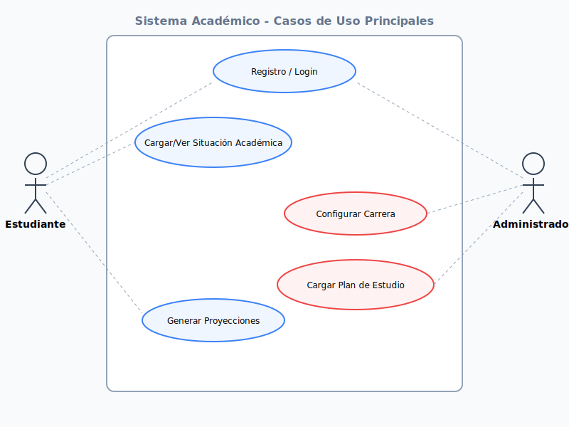

# Actores y Funcionalidades Principales

> Punto 1 del sprint 1. **Owner:** Marcos Bejarano. **Estado:** Completado.

## Actores

### Estudiante
Usuario principal del sistema que busca organizar su vida académica y colaborar con otros compañeros.

**Funcionalidades clave (según módulos):**
- **Módulo 1 & 3: Gestión Académica**
  - Registrarse e iniciar sesión en el sistema.
  - Configurar perfil personal (datos personales, foto, privacidad).
  - Cargar situación académica (materias aprobadas, regularizadas, cuatrimestres).
  - Registrar materias a cursar y actualizar el estado de las cursadas.
  - Registrar presentaciones a exámenes finales.
  - Gestionar la foja académica.
- **Módulo 4: Asistente Académico**
  - Consultar análisis de situación: materias disponibles para inscripción, finales pendientes, avance de carrera.
  - Planificar cursada mediante un planificador interactivo (mover materias entre días).
  - Guardar y modificar proyecciones de planes de estudio.
- **Módulo 5 & 6: Red Social y Colaboración**
  - Gestionar lista de contactos (agregar, ver, aceptar solicitudes).
  - Consultar novedades académicas y posteos de contactos en el feed.
  - Crear, editar, unirse o cancelar sesiones de estudio colaborativo.
  - Consultar disponibilidad de sesiones de estudio.
- **Módulo 7 & 8: Materiales y Notificaciones**
  - Consultar, subir y compartir material de estudio por materia.
  - Valorar material de estudio (👍/👎).
  - Denunciar contenido inapropiado.
  - Recibir y visualizar notificaciones (in-app y por email).

### Administrador
Encargado de la configuración estructural del sistema y la moderación de la comunidad.

**Funcionalidades clave:**
- **Módulo 1 & 2: Configuración del Sistema**
  - Crear y actualizar datos de carreras universitarias.
  - Configurar planes de estudio (carga de materias, años, duraciones, correlatividades y condiciones).
  - Gestionar permisos para la configuración de carreras y planes.
- **Módulo 4 & 9: Operaciones y Reportes**
  - Cargar la oferta académica de cada período.
  - Generar reportes de uso, estadísticas del sistema y reportes sociales.
- **Módulo 7: Moderación**
  - Configurar motivos de denuncia y umbrales para materiales.
  - Gestionar y moderar contenidos denunciados (confirmar/rechazar denuncias).
  - Gestionar el estado de las cuentas de estudiantes (suspender/reactivar).

## Casos de uso prioritarios para sprint 1

Las pantallas que conforman el skeleton funcional del sistema:

**Estudiante:**
- Login / Registro
- Home (Dashboard con resumen de avance)
- Mi situación académica (Carga y visualización)
- Asistente académico (Planificador y proyecciones)
- Red Social (Contactos y Feed)
- Sesiones de estudio (Buscador y creación)
- Materiales (Repositorio por materia)
- Mi perfil

**Administrador:**
- Login Admin
- Dashboard Admin (Métricas rápidas)
- Gestión de Carreras
- Gestión de Planes de Estudio y Materias
- Moderación de Denuncias
- Gestión de Usuarios

## Diagramas de Casos de Uso

### Flujos Principales

*El diagrama incluye los flujos de: Registro/Login, Ver Situación Académica, Configurar Carrera y Cargar Plan de Estudio.*

## Pendientes de definir
- [x] ¿Hay un actor "visitante"? Solo redirige a login.
- [x] ¿El administrador inicial? Se creará mediante un script de seed inicial.
- [x] Confirmar lista de pantallas: Validado con el equipo según el skeleton actual.
